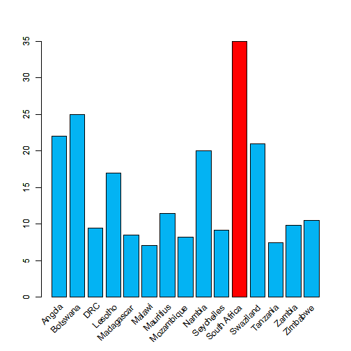

## INTRODUCTION
This presentation is part of the Course Project for the Coursera Developing Data Products class. The peer assessed assignment has two parts. First, we need to create a Shiny application and deploy it on Rstudio's servers. Second, we should use Slidify or Rstudio Presenter to prepare a reproducible pitch presentation about the application. This presentation adresses the second part of the course project.
The app developed for the first part of the assignment is avalilable [here](https://kapondot.shinyapps.io/DevelopingDataProjects/):

Source code for ui.R and server.R files are available on the [Kapondo GitHub repo](https://github.com/Kapondo/Dataproducts):


--- .class #id 

## Calculation of the Body Mass Index (BMI)

This app helps to calculate a simple body mass index (BMI) using a simple formula :$\LARGE BMI = \frac {mass_{kg}}{height_m^2}$

The app is only applicable where ther units on mass are in kg and the units of height are in meters.


## General Table of BMI 

Category |	BMI |($\frac{kg}{m^2}$) 
---------|-------|-----------------
          | from | to
Very severely underweight |  	|15.0
Severely underweight    |15	    |16
Underweight	|16	| 18.5
Normal (healthy weight) |	18.5 |	25
Overweight	| 25 |	30
Obese Class I (Moderately obese) |	30 |	35


--- .class #id

## Function for calculating BMI


```r
BMI <- function(m, h){
    m/h^2
}
paste("If your mass is", m = 90, "and your height is:", h=1.75)
```

```
## [1] "If your mass is 90 and your height is: 1.75"
```

```r
paste("Your body mass BMI is: ", BMI(90, 1.75))
```

```
## [1] "Your body mass BMI is:  29.3877551020408"
```

--- .class #id

## Importing and Plotting Data from SADC countries

**Conclusion:** From Analysis of different Countries in the SADC region, **South Africa** has the highest percentage of people with a **BMI>=30** of **35%** as indicated in red colour
